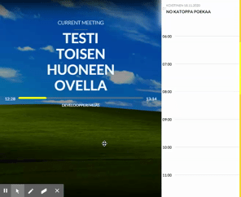
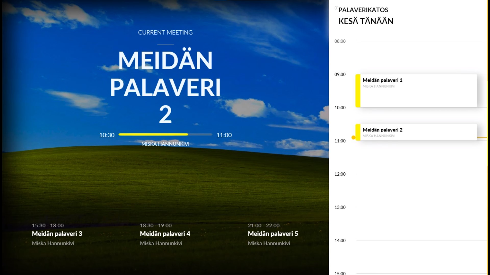

> What if meeting rooms ("neukkarit" in short) each invidually would have current date and usage shown at the door, especially those where you can't see inside of?

hence why born,

# ConferenceApp  

Angular, Node and SQL based application to show current date meeting in a specific "room".

| Frontend | Backend | Database | Tested On |
|--|--|--|--|
|  |  |  |  |





https://user-images.githubusercontent.com/42906162/199672322-f0c88e39-a0e5-4c64-801b-40a1f0e66a9a.mp4


## run in development mode
* docker-compose up --build
  * fires up the backend and frontend and database
    * frontend is on http://localhost:8080
    * backend is on http://localhost:3000
    * database is on http://localhost:1433
      * actually hardcoded to be in ip address space of docker-compose
* go to http://localhost:8080
* there room selection with url `/dashboard/:roomId`
----
* to add events
  * POST 
    * /api/rooms/```{roomId}```/add/event
* with body
    ```sh 
  {
  "organizer": "<organizer>",
  "description": "<description>",
  "startTime": "<2023-10-05 20:15:00>",
  "endTime": "<2023-10-05 20:30:00>",
  "subject": "<subject>"
  } 
  ```


### backround
* database filled with demodata on startup (to today)
* with specialized scraper it would be possible to subscribe to eg. google calendar data to and add it to this 
  * i didn't yet include post or put mechanism to backend cause thought not to do by hand


----
## nonsense afterwards - dont read
## !! Huomioita työssä !!

1. kesä ja talviaikakäsittely hardcoodattua - 3600 sekuntia missä käytetäänkään

2. tapahtumien päivitys ei tapahdu ellei näkymä refreshaa ( tähän käsittelyyn pitäisi tehdä vakiopolleri frontendiin, joko  pollataan tapahtumanmuutos bittiä tai kokonaan aina uutta meetings arrayta)

3. testiä varten hypätään http://localhost:4200/dashboard/{roomId}

4. RoomId voi olla 1 - (kuinka monelle huoneelle on dataa kannassa...)

5. Kellonaika on synkronoitu kaikkien näkymäosien kanssa time servicellä

6. tapahtumat eivät ole vielä synkronoitu koska tämä aiempi käsittely niiden päivittämiselle on 404

7. jos tapahtumia on, niin vähimmäisvaatimus on 
	* otsikko ja 
	* järjestäjä sekä 
	* alku että päättymisaika

8. huoneella täytyy olla 
	* nimi


This project was generated with [Angular CLI](https://github.com/angular/angular-cli) version 9.1.8.

